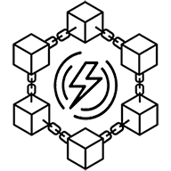

# PowerChain &middot; 
PowerChain is a platform that allows energy actors to record and exchange energy assets on a private blockchain network.

**Work In Progress...**

## Install Script
The install_prerequisites.sh script installs all the prerequisites for PowerChain. It also adds the PowerChain scripts to PATH.

## PowerChain Scripts
### pc_CreateNetwork
This script is used to generate the validator nodes for a private proof of authority Ethereum network and a bootnode. It will create a "network" folder which will contain a bootnode folder and one folder for each
validator. In each folder there is a "start.sh" script which starts the node. The validator folder will also
include a "startSigner.sh" script which starts an external signer (Clef). An external signer is used to avoid
having to unlock the validator nodes and have then exposed to unwanted JSON-RPC API calls. The first validator is getting assigned with 10^20 ETH (They have to be send to the faucet).

### pc_CreateAccount
This script create a normal network node. No external signer is needed.

### pc_CreateBootNode
This script creates a BootNode. In order for a node to use the newly created bootnode you need to add its address in the relevant bootnodes.txt file.s

### pc_DeployContract
This script is used to deploy a smart contract into the chain.
Below are the script arguments:

    positional arguments:
    path        Path to smart contract
    icp         Path to ICP file of a running network peer
    optional arguments:
    -h, --help  show this help message and exit

### pc_Network
Starts an interactive JavaScript enviroment. It connects to the node using the get.ipc file. You should run the script in a folder with a get.ipc file.

## Userful Documentation
Web3.py: https://web3py.readthedocs.io/ \
Web3.js: https://web3js.readthedocs.io/ \
py-solc-x: https://solcx.readthedocs.io/en/latest/ \

## Licensing
* [MIT](https://github.com/MnAppsNet/PowerChain/blob/master/LICENSE)
* Copyright 2023